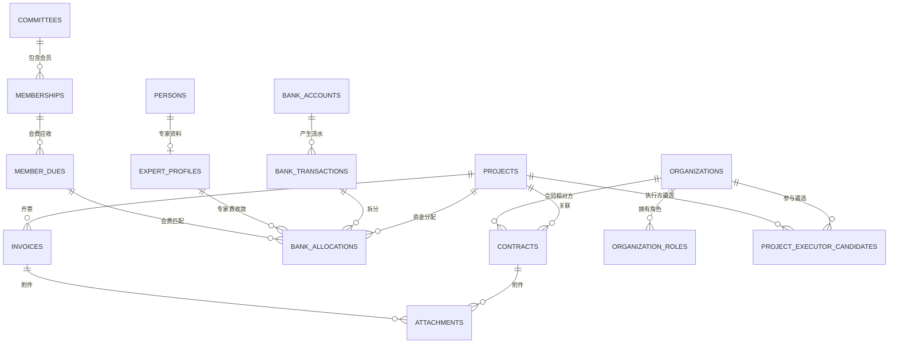

# 业务数据管理系统设计方案

## 1. 文档信息

| 项目 | 内容 |
| --- | --- |
| 文档状态 | 设计方案，待业务与技术评审 |
| 业务依据 | `ref/业务流程图.png` |
| 字段参考 | `ref/样表.xlsx` |
| 口径原则 | 业务流程图优先；样表仅用于补充不冲突的字段 |
| 建设模式 | 前后端分离的 Web 管理系统 |

本方案只覆盖设计，不包含代码实现、数据库建库或数据迁移操作。

## 2. 建设目标

系统用于集中存储、编辑、查询和审计项目相关业务数据，以项目编码作为核心业务关联键，将项目、合同、银行流水、发票和各类基础资料连接起来。

核心目标如下：

1. 建立唯一、稳定、可追溯的项目台账。
2. 统一管理项目合同、收付款流水和发票。
3. 自动汇总项目应收、已收、已开票、应付和已付金额。
4. 建立支持方、执行方、专家和会员基础资料库。
5. 支持银行流水导入、去重、分配、匹配和对账。
6. 对身份证号、银行卡号等敏感数据进行加密、脱敏和访问审计。
7. 保留完整变更历史，任何汇总金额均可追溯到来源记录。

## 3. 业务范围

### 3.1 八类业务台账

以流程图为准，本期系统包含以下八类业务台账：

| 序号 | 业务台账 | 主要职责 |
| --- | --- | --- |
| 1 | 项目台账 | 项目基础信息和财务汇总 |
| 2 | 合同台账 | 支持协议、执行协议及其他项目合同 |
| 3 | 银行日记账 | 收款、执行款和专家费等实际资金流水 |
| 4 | 发票台账 | 项目开票记录及开票金额汇总 |
| 5 | 支持方库 | 支持方基础信息及累计合作金额 |
| 6 | 执行方库 | 执行方基础信息及累计合作金额 |
| 7 | 专家库 | 专家资料、资质和收款信息 |
| 8 | 会员库 | 专委会会员及会费收款信息 |

Excel 中的“供应商库”按“执行方库”理解；“志愿者库”不在本期范围内。

### 3.2 角色分工

| 角色 | 主要职责 |
| --- | --- |
| PM | 项目立项、项目资料维护、基础资料提交、查看负责项目 |
| 合规 | 支持协议和执行协议登记、合同资料复核 |
| 财务 | 银行流水导入、收付款登记、发票登记、流水匹配与对账 |
| 复核人 | 专家资料和敏感资料复核 |
| 系统管理员 | 用户、角色、字典、编码规则和系统参数维护 |
| 只读用户 | 按授权范围查看台账和报表，不得编辑 |

### 3.3 核心业务流程

#### 3.3.1 项目立项

1. PM 填写平台、发布日期、项目名称、项目性质、项目周期、立项金额、执行成本等信息。
2. 系统依据项目编码规则生成唯一项目编码。
   - 格式为 `PRJ-YYYY-NNN`，序号不足三位时补零，超过 999 后自然扩展。
   - 每年使用独立数据库计数器，在项目创建事务内原子递增；删除项目不回收序号。
3. 项目编码生成后原则上不可修改；确需修改时由管理员操作并记录审计日志。
4. 项目进入“进行中”状态，允许登记合同、流水和发票。

#### 3.3.2 多家支持方签署支持协议

1. 合规选择项目并登记支持协议。
2. 合同关联项目编码和支持方。
3. 支持方不存在时，先创建支持方资料；系统对规范化后的机构名称进行重复检查。
4. 已生效支持协议金额汇总为项目“应收金额”。
5. 同一项目允许关联多家支持方和多份支持协议。

#### 3.3.3 收到支持款和开票

1. 财务导入或录入银行收款流水。
2. 财务将流水分配给项目，业务分类标记为“支持款收入”。
3. 已确认分配金额汇总为项目“已收金额”。
4. 财务登记发票并关联项目编码。
5. 有效发票的价税合计汇总为项目“已开票金额”。

#### 3.3.4 执行方遴选和签署执行协议

1. PM 在遴选阶段维护参与遴选的执行方。
2. 新执行方进入执行方库，已有执行方直接复用。
3. 遴选成功后登记执行协议并关联项目编码。
4. 已生效执行协议金额汇总为项目“应付执行款”。

#### 3.3.5 支付执行款

1. 财务录入或导入付款流水。
2. 流水关联项目，业务分类标记为“执行款支出”。
3. 已确认分配金额汇总为项目“已付执行款”。

#### 3.3.6 支付专家劳务费

1. 付款前选择专家库中的专家。
2. 财务流水关联项目和专家，业务分类标记为“专家费支出”。
3. 已确认分配金额汇总为项目“已付专家费”。

#### 3.3.7 专委会会员及会费

1. 成立专委会并生成专委会编码。
2. 录入会员名称、所属专委会、会员类别和会费金额。
3. 收到会费后，系统依据会员名称、专委会、金额和时间生成匹配建议。
4. 财务确认匹配后更新会费实收金额和到账日期。
5. 名称匹配只作为建议，不直接自动确认，以避免同名误匹配。

### 3.4 汇总规则

| 项目汇总字段 | 数据来源 | 计算规则 |
| --- | --- | --- |
| 应收金额 | 合同台账 | 生效的支持类合同金额之和 |
| 已收金额 | 银行流水分配 | 已确认的支持款收入分配金额之和 |
| 已开票金额 | 发票台账 | 正常发票价税合计减红字发票价税合计 |
| 应付执行款 | 合同台账 | 生效的执行类合同金额之和 |
| 已付执行款 | 银行流水分配 | 已确认的执行款支出分配金额之和 |
| 已付专家费 | 银行流水分配 | 已确认的专家费支出分配金额之和 |

以上汇总字段均为只读派生数据，不允许通过项目编辑表单直接修改。

## 4. 总体技术架构

### 4.1 推荐技术栈

| 层级 | 推荐方案 | 说明 |
| --- | --- | --- |
| Web 前端 | React + TypeScript + Vite | 适合复杂表格、表单和模块化前端 |
| 路由 | React Router | 页面路由和权限路由 |
| 服务端状态 | TanStack Query | 缓存、刷新、并发请求和错误状态管理 |
| 数据表格 | TanStack Table | 支持高密度表格、固定列和自定义交互 |
| 表单校验 | React Hook Form + Zod | 前端类型与校验规则统一 |
| 后端 | NestJS + TypeScript | 模块化、依赖注入、守卫和审计扩展能力较好 |
| ORM | Prisma | 数据模型、迁移和类型安全查询 |
| 数据库 | PostgreSQL | 事务、约束、JSON、视图和索引能力完整 |
| 文件存储 | MinIO 或兼容 S3 的对象存储 | 保存合同、发票和资质附件 |
| 缓存/任务 | Redis，可按需启用 | Excel 导入、大批量汇总和异步任务 |
| 认证 | JWT；具备条件时对接企业 OIDC | 支持统一登录和 API 鉴权 |
| 部署 | Docker Compose 起步，后续可迁移 Kubernetes | 保持环境一致和便于交付 |

如现有组织已有 Java、Vue 或统一身份平台标准，可保持本方案的数据模型和接口边界，仅替换具体框架。

### 4.2 逻辑架构

```text
浏览器
  │ HTTPS
  ▼
前端静态站点
  │ /api/v1
  ▼
后端 API
  ├── 认证与权限
  ├── 项目与汇总
  ├── 合同管理
  ├── 银行流水与对账
  ├── 发票管理
  ├── 基础资料库
  ├── 文件与导入任务
  └── 审计日志
       │
       ├── PostgreSQL
       ├── MinIO/S3
       └── Redis（可选）
```

### 4.3 设计原则

1. 项目编码是业务关联键，UUID 是数据库主键。
2. 原始银行流水不可覆盖修改；修正通过撤销、重新分配或冲销完成。
3. 一笔流水可以拆分到多个项目，一个项目可以接收多笔流水。
4. 项目汇总由数据库视图或服务端查询生成，不维护可编辑的冗余金额。
5. 所有写操作必须在后端校验权限和业务状态，不能依赖前端限制。
6. 重要业务对象采用乐观锁，防止多人同时编辑造成数据覆盖。
7. 删除默认采用业务作废或软删除，不物理删除财务和合同历史。

## 5. 数据库设计

### 5.1 公共字段规范

除关联表和特殊只读表外，业务表统一包含：

| 字段 | 类型 | 说明 |
| --- | --- | --- |
| `id` | `uuid` | 主键 |
| `created_at` | `timestamptz` | 创建时间 |
| `created_by` | `uuid` | 创建人 |
| `updated_at` | `timestamptz` | 最后更新时间 |
| `updated_by` | `uuid` | 最后更新人 |
| `version` | `integer` | 乐观锁版本号 |
| `deleted_at` | `timestamptz nullable` | 软删除时间，仅适用于非财务基础数据 |

金额字段统一使用 `numeric(18,2)`；日期使用 `date`；带时间的事件使用 `timestamptz`；枚举在应用层和数据库约束中保持一致。

### 5.2 核心实体关系



业务上展示八类台账，物理数据库按规范化原则拆分为核心表、关联表和辅助表，不要求一类台账只对应一张物理表。

### 5.3 项目表 `projects`

| 字段 | 类型 | 约束/说明 |
| --- | --- | --- |
| `project_code` | `varchar(32)` | 唯一、非空，项目唯一业务标识 |
| `platform` | `varchar(100)` | 平台 |
| `published_on` | `date` | 发布日期 |
| `name` | `varchar(200)` | 项目名称 |
| `nature` | `varchar(50)` | 项目性质，使用字典值 |
| `period_months` | `integer` | 项目周期统一折算为月数，正整数；前端使用“数值 + 月/年单位”录入 |
| `approved_amount` | `numeric(18,2)` | 立项金额，非负 |
| `execution_cost` | `numeric(18,2)` | 执行成本，非负 |
| `pm_user_id` | `uuid` | 项目经理，关联状态正常的 PM 用户；新建项目必填 |
| `pm_name` | `varchar(100)` | 项目经理姓名快照，PM 改名时同步更新，保证历史数据可读 |
| `status` | `varchar(20)` | `DRAFT/ACTIVE/CLOSED/CANCELLED` |
| `remark` | `text` | 备注 |

应收、已收、已开票、应付执行款、已付执行款和已付专家费不直接存储在该表中，由 `project_financial_summary` 视图提供。

### 5.4 机构及角色

#### `organizations`

| 字段 | 类型 | 说明 |
| --- | --- | --- |
| `organization_code` | `varchar(32)` | 系统生成机构编码，唯一 |
| `name` | `varchar(200)` | 机构名称 |
| `normalized_name` | `varchar(200)` | 去除空格、括号差异后的查重名称 |
| `platform` | `varchar(100)` | 入库平台 |
| `owner_user_id` | `uuid` | 负责 PM |
| `contact_name` | `varchar(100)` | 联系人 |
| `contact_phone` | `varchar(30)` | 联系电话 |
| `status` | `varchar(20)` | `ACTIVE/INACTIVE` |

#### `organization_roles`

| 字段 | 类型 | 说明 |
| --- | --- | --- |
| `organization_id` | `uuid` | 机构 ID |
| `role_type` | `varchar(20)` | `SUPPORTER/EXECUTOR` |
| `joined_on` | `date` | 入库日期 |
| `review_status` | `varchar(20)` | `PENDING/APPROVED/REJECTED` |

`organization_id + role_type` 建立唯一约束。同一机构可同时是支持方和执行方，但前端仍分别呈现“支持方库”和“执行方库”。累计合作金额由有效合同按角色汇总，不作为可编辑字段。

#### `project_executor_candidates`

| 字段 | 类型 | 说明 |
| --- | --- | --- |
| `project_id` | `uuid` | 关联项目 |
| `organization_id` | `uuid` | 具备执行方角色的机构 |
| `selection_status` | `varchar(20)` | `CANDIDATE/SELECTED/NOT_SELECTED/WITHDRAWN` |
| `selected_on` | `date nullable` | 确定中选日期 |
| `remark` | `text` | 遴选备注 |

`project_id + organization_id` 建立唯一约束。只有 `SELECTED` 的执行方可以登记该项目的执行协议。

### 5.5 合同表 `contracts`

| 字段 | 类型 | 说明 |
| --- | --- | --- |
| `contract_no` | `varchar(64)` | 合同编号，唯一 |
| `project_id` | `uuid` | 关联项目 |
| `contract_direction` | `varchar(20)` | `RECEIVABLE/PAYABLE` |
| `contract_type` | `varchar(30)` | `SUPPORT/EXECUTION/OTHER` |
| `contract_entity` | `varchar(200)` | 本方签约主体 |
| `counterparty_id` | `uuid nullable` | 支持方或执行方机构 |
| `amount` | `numeric(18,2)` | 合同含税金额，非负 |
| `signed_on` | `date` | 签约日期 |
| `effective_on` | `date nullable` | 生效日期 |
| `expires_on` | `date nullable` | 到期日期 |
| `status` | `varchar(20)` | `DRAFT/SIGNED/TERMINATED/VOID` |
| `parent_contract_id` | `uuid nullable` | 补充协议或变更协议关联原合同 |
| `remark` | `text` | 备注 |

支持类合同必须选择支持方，执行类合同必须选择执行方。只有 `SIGNED` 状态合同参与项目汇总。

### 5.6 银行账户与流水

#### `bank_accounts`

| 字段 | 类型 | 说明 |
| --- | --- | --- |
| `account_name` | `varchar(200)` | 本方账户名称 |
| `bank_name` | `varchar(200)` | 开户行 |
| `account_number_encrypted` | `text` | 加密后的账号 |
| `account_number_masked` | `varchar(64)` | 脱敏显示值 |
| `status` | `varchar(20)` | `ACTIVE/INACTIVE` |

#### `bank_transactions`

| 字段 | 类型 | 说明 |
| --- | --- | --- |
| `bank_account_id` | `uuid` | 本方银行账户 |
| `transaction_no` | `varchar(100) nullable` | 银行流水号 |
| `transaction_at` | `timestamptz` | 实际交易时间 |
| `counterparty_name` | `varchar(200)` | 对方账户名称 |
| `counterparty_account_masked` | `varchar(64) nullable` | 对方账号脱敏值 |
| `direction` | `varchar(10)` | `IN/OUT` |
| `amount` | `numeric(18,2)` | 绝对金额，必须大于零 |
| `nature` | `varchar(50)` | 银行摘要或业务性质 |
| `settlement_applicable` | `boolean` | 是否纳入项目/会费结算 |
| `match_status` | `varchar(20)` | `UNMATCHED/PARTIAL/MATCHED/EXCLUDED` |
| `source_type` | `varchar(20)` | `MANUAL/EXCEL/BANK_FILE` |
| `source_row_hash` | `varchar(64)` | 导入去重指纹 |
| `raw_data` | `jsonb` | 原始导入行，便于审计 |

#### `bank_allocations`

| 字段 | 类型 | 说明 |
| --- | --- | --- |
| `bank_transaction_id` | `uuid` | 原始流水 |
| `project_id` | `uuid nullable` | 项目类分配关联项目 |
| `member_due_id` | `uuid nullable` | 会费类分配关联应收会费 |
| `expert_id` | `uuid nullable` | 专家费关联专家资料 |
| `category` | `varchar(30)` | `SUPPORT_RECEIPT/EXECUTION_PAYMENT/EXPERT_FEE/MEMBER_DUE/OTHER` |
| `allocated_amount` | `numeric(18,2)` | 分配金额，必须大于零 |
| `status` | `varchar(20)` | `DRAFT/CONFIRMED/REVERSED` |
| `confirmed_by` | `uuid nullable` | 确认人 |
| `confirmed_at` | `timestamptz nullable` | 确认时间 |

同一流水所有未撤销分配金额之和不得超过流水金额。收入流水不能分配为支出分类，支出流水不能分配为收入分类。只有 `CONFIRMED` 分配参与汇总。

### 5.7 发票表 `invoices`

| 字段 | 类型 | 说明 |
| --- | --- | --- |
| `invoice_code` | `varchar(32) nullable` | 发票代码 |
| `invoice_number` | `varchar(64)` | 发票号码 |
| `project_id` | `uuid` | 关联项目 |
| `issued_on` | `date` | 开票日期 |
| `invoice_type` | `varchar(30)` | 专票、普票等字典值 |
| `invoice_platform` | `varchar(100)` | 开票平台 |
| `buyer_name` | `varchar(200)` | 购买方名称 |
| `amount_excluding_tax` | `numeric(18,2)` | 不含税金额 |
| `tax_rate` | `numeric(8,6)` | 税率，如 `0.06` |
| `tax_amount` | `numeric(18,2)` | 税额 |
| `total_amount` | `numeric(18,2)` | 价税合计 |
| `kind` | `varchar(10)` | `BLUE/RED` |
| `status` | `varchar(20)` | `NORMAL/VOID` |
| `original_invoice_id` | `uuid nullable` | 红字发票关联原发票 |

`invoice_code + invoice_number` 建立唯一约束。项目已开票金额以有效蓝票价税合计减有效红票价税合计计算。

### 5.8 专家资料

#### `persons`

| 字段 | 类型 | 说明 |
| --- | --- | --- |
| `name` | `varchar(100)` | 姓名 |
| `phone_encrypted` | `text` | 加密手机号 |
| `phone_masked` | `varchar(30)` | 脱敏手机号 |
| `id_number_encrypted` | `text` | 加密证件号 |
| `id_number_hash` | `varchar(64)` | 用于查重的不可逆哈希 |
| `id_number_masked` | `varchar(32)` | 脱敏证件号 |
| `email` | `varchar(200)` | 邮箱 |
| `organization_name` | `varchar(200)` | 单位 |
| `department` | `varchar(100)` | 专业/科室 |
| `position` | `varchar(100)` | 职务 |

#### `expert_profiles`

| 字段 | 类型 | 说明 |
| --- | --- | --- |
| `person_id` | `uuid` | 关联人员，唯一 |
| `professional_title` | `varchar(100)` | 职称 |
| `bank_name` | `varchar(200)` | 开户行 |
| `bank_account_encrypted` | `text` | 加密银行账号 |
| `bank_account_masked` | `varchar(64)` | 脱敏银行账号 |
| `joined_on` | `date` | 入库日期 |
| `form_owner_id` | `uuid` | 填表 PM |
| `reviewer_id` | `uuid nullable` | 复核人 |
| `review_status` | `varchar(20)` | `PENDING/APPROVED/REJECTED` |

专家资质证明通过附件表保存，不直接存放于数据库字段中。

### 5.9 专委会、会员及会费

#### `committees`

| 字段 | 类型 | 说明 |
| --- | --- | --- |
| `committee_code` | `varchar(32)` | 专委会编码，唯一 |
| `name` | `varchar(200)` | 专委会名称 |
| `established_on` | `date` | 成立日期 |
| `owner_user_id` | `uuid` | 负责 PM |
| `status` | `varchar(20)` | `ACTIVE/INACTIVE` |

#### `memberships`

| 字段 | 类型 | 说明 |
| --- | --- | --- |
| `member_name` | `varchar(200)` | 会员名称 |
| `committee_id` | `uuid` | 所属专委会 |
| `member_type` | `varchar(50)` | 会员类别 |
| `pm_user_id` | `uuid` | 负责 PM |
| `joined_on` | `date nullable` | 入会日期 |
| `status` | `varchar(20)` | `ACTIVE/INACTIVE` |

#### `member_dues`

| 字段 | 类型 | 说明 |
| --- | --- | --- |
| `membership_id` | `uuid` | 会员关系 |
| `due_code` | `varchar(32)` | 会费应收编号，唯一 |
| `period_label` | `varchar(50) nullable` | 缴费期次；一次性会费可为空 |
| `amount_due` | `numeric(18,2)` | 应收会费 |
| `due_on` | `date nullable` | 应缴日期 |
| `status` | `varchar(20)` | `UNPAID/PARTIAL/PAID/WAIVED` |

实收金额和最后到账日期由关联的会费类银行流水分配计算。会费是否按年、按届或一次性收取由业务字典和 `period_label` 表达，不在数据库模型中预设固定周期。

### 5.10 附件和审计

#### `attachments`

| 字段 | 类型 | 说明 |
| --- | --- | --- |
| `object_type` | `varchar(30)` | `CONTRACT/INVOICE/EXPERT/OTHER` |
| `object_id` | `uuid` | 业务对象 ID |
| `file_name` | `varchar(255)` | 原始文件名 |
| `storage_key` | `varchar(500)` | 对象存储键 |
| `content_type` | `varchar(100)` | MIME 类型 |
| `size_bytes` | `bigint` | 文件大小 |
| `sha256` | `varchar(64)` | 文件完整性校验 |
| `uploaded_by` | `uuid` | 上传人 |

#### `audit_logs`

| 字段 | 类型 | 说明 |
| --- | --- | --- |
| `actor_user_id` | `uuid` | 操作人 |
| `action` | `varchar(30)` | `CREATE/UPDATE/VOID/CONFIRM/EXPORT/VIEW_SENSITIVE` |
| `object_type` | `varchar(50)` | 对象类型 |
| `object_id` | `uuid` | 对象 ID |
| `before_data` | `jsonb` | 修改前数据，敏感字段不记录明文 |
| `after_data` | `jsonb` | 修改后数据，敏感字段不记录明文 |
| `request_id` | `varchar(64)` | 请求追踪 ID |
| `ip_address` | `inet` | 请求 IP |
| `occurred_at` | `timestamptz` | 操作时间 |

### 5.11 用户、权限及系统辅助表

| 表 | 主要字段 | 用途 |
| --- | --- | --- |
| `users` | 登录名、姓名、部门、状态、外部身份 ID | 系统用户 |
| `roles` | 角色编码、名称、状态 | PM、财务、合规等角色 |
| `permissions` | 权限编码、资源、操作 | 功能权限定义 |
| `user_roles` | 用户 ID、角色 ID | 用户角色关联 |
| `role_permissions` | 角色 ID、权限 ID | 角色权限关联 |
| `data_scopes` | 用户或角色、范围类型、范围值 | 本人、部门或全部项目的数据范围 |
| `dictionaries` | 字典类型、编码、名称、排序、状态 | 项目性质、合同类型等业务字典 |
| `code_sequences` | 编码类型、周期、当前序号 | 并发安全生成项目和机构编码 |
| `import_batches` | 文件、类型、状态、总数、成功数、失败数 | Excel 导入批次和进度 |
| `import_errors` | 批次、行号、字段、错误码、错误信息 | 导入错误明细 |

权限关系表使用组合唯一约束。`code_sequences` 更新时使用数据库行锁或原子语句，避免并发生成重复编码。

### 5.12 项目财务汇总视图

`project_financial_summary` 至少返回：

| 字段 | 说明 |
| --- | --- |
| `project_id` | 项目 ID |
| `receivable_amount` | 应收金额 |
| `received_amount` | 已收金额 |
| `invoiced_amount` | 已开票金额 |
| `payable_execution_amount` | 应付执行款 |
| `paid_execution_amount` | 已付执行款 |
| `paid_expert_amount` | 已付专家费 |
| `unreceived_amount` | 应收减已收 |
| `uninvoiced_amount` | 已收减已开票，用于提示而非会计结论 |
| `unpaid_execution_amount` | 应付执行款减已付执行款 |

数据量较小时使用普通视图；达到性能瓶颈后再采用物化视图或项目汇总读模型，并通过事务后事件刷新。首期不提前引入冗余汇总表。

### 5.13 索引与约束

1. `projects(project_code)` 唯一索引。
2. `contracts(contract_no)` 唯一索引；`contracts(project_id, status, contract_type)` 组合索引。
3. `bank_transactions(source_row_hash)` 条件唯一索引。
4. `bank_transactions(transaction_at, direction, match_status)` 组合索引。
5. `bank_allocations(project_id, category, status)` 组合索引。
6. `invoices(invoice_code, invoice_number)` 唯一索引。
7. `organizations(normalized_name)` 唯一索引，用于阻止规范化名称重复。
8. `persons(id_number_hash)` 条件唯一索引。
9. 所有外键建立索引，财务表禁止级联删除。

## 6. 后端设计

### 6.1 模块划分

```text
src/modules
├── auth             认证、令牌和当前用户
├── users            用户、角色和数据权限
├── projects         项目及项目财务汇总
├── contracts        合同登记、状态和附件
├── organizations    支持方、执行方和重复检查
├── banking          银行账户、流水、导入和分配
├── invoices         发票和红票/作废处理
├── experts          专家资料、资质和敏感字段授权
├── memberships      专委会、会员和会费
├── files            对象存储和下载授权
├── imports          Excel 预检、错误报告和正式入库
├── reconciliation   对账规则和异常项
├── audit            审计日志
└── dictionaries     项目性质、合同类型等字典
```

### 6.2 API 规范

- API 前缀统一为 `/api/v1`。
- 使用 JSON；日期为 `YYYY-MM-DD`，时间为 ISO 8601 UTC 时间。
- 列表统一支持 `page`、`pageSize`、`sort` 和业务筛选参数。
- 写接口接收 `version`，版本不一致返回 HTTP `409 Conflict`。
- 错误响应包含 `code`、`message`、`fieldErrors` 和 `requestId`。
- 创建导入、确认匹配等关键接口支持 `Idempotency-Key`。
- 金额在 API 中使用字符串传输，避免 JavaScript 浮点误差。

统一错误示例：

```json
{
  "code": "BANK_ALLOCATION_EXCEEDS_TRANSACTION",
  "message": "分配金额超过流水可分配余额",
  "fieldErrors": {
    "allocatedAmount": "当前最多可分配 12000.00"
  },
  "requestId": "req_01J..."
}
```

### 6.3 核心接口

#### 项目

| 方法 | 路径 | 用途 |
| --- | --- | --- |
| `GET` | `/projects` | 查询项目列表 |
| `POST` | `/projects` | 创建项目并生成项目编码 |
| `GET` | `/projects/{id}` | 获取项目详情 |
| `PATCH` | `/projects/{id}` | 修改项目基础信息 |
| `GET` | `/projects/{id}/financial-summary` | 获取项目财务汇总 |
| `GET` | `/projects/{id}/timeline` | 获取资金轨道事件 |
| `POST` | `/projects/{id}/close` | 结项并执行完整性检查 |

#### PM 管理

| 方法 | 路径 | 用途 |
| --- | --- | --- |
| `GET` | `/project-managers/options` | 查询可分配的有效 PM |
| `GET` | `/project-managers` | 管理员查询 PM 名册，包括停用账号 |
| `POST` | `/project-managers` | 管理员创建 PM 登录账号 |
| `PATCH` | `/project-managers/{id}` | 管理员修改姓名、部门、用户名、密码或状态 |
| `DELETE` | `/project-managers/{id}` | 管理员停用 PM，保留历史业务关联 |

#### 合同

| 方法 | 路径 | 用途 |
| --- | --- | --- |
| `GET` | `/contracts` | 查询合同台账 |
| `POST` | `/contracts` | 新建合同 |
| `PATCH` | `/contracts/{id}` | 修改草稿合同 |
| `POST` | `/contracts/{id}/sign` | 标记签署并纳入汇总 |
| `POST` | `/contracts/{id}/void` | 作废合同 |
| `POST` | `/contracts/{id}/attachments` | 上传合同附件 |

#### 银行流水和对账

| 方法 | 路径 | 用途 |
| --- | --- | --- |
| `GET` | `/bank-transactions` | 查询银行流水 |
| `POST` | `/bank-transactions` | 手工录入流水 |
| `POST` | `/bank-transactions/imports` | 上传并预检流水文件 |
| `POST` | `/bank-transactions/imports/{id}/confirm` | 确认导入 |
| `GET` | `/bank-transactions/{id}/match-suggestions` | 获取匹配建议 |
| `POST` | `/bank-transactions/{id}/allocations` | 新建流水分配 |
| `POST` | `/bank-allocations/{id}/confirm` | 确认分配 |
| `POST` | `/bank-allocations/{id}/reverse` | 撤销分配 |

#### 发票

| 方法 | 路径 | 用途 |
| --- | --- | --- |
| `GET` | `/invoices` | 查询发票台账 |
| `POST` | `/invoices` | 登记发票 |
| `PATCH` | `/invoices/{id}` | 修改发票 |
| `POST` | `/invoices/{id}/void` | 作废发票 |
| `POST` | `/invoices/{id}/red-invoice` | 登记关联红字发票 |

#### 基础资料和会员

| 方法 | 路径 | 用途 |
| --- | --- | --- |
| `GET/POST` | `/supporters` | 支持方列表和新增 |
| `GET/POST` | `/executors` | 执行方列表和新增 |
| `GET/POST` | `/experts` | 专家列表和新增 |
| `POST` | `/experts/{id}/review` | 专家资料复核 |
| `GET/POST` | `/committees` | 专委会管理 |
| `GET/POST` | `/memberships` | 会员管理 |
| `GET/POST` | `/member-dues` | 会费应收管理 |

### 6.4 事务边界

以下操作必须在单个数据库事务中完成：

1. 创建项目与分配项目编码。
2. 合同签署状态变更与审计日志写入。
3. 银行流水分配确认、余额校验、流水匹配状态更新和审计日志写入。
4. 流水分配撤销与原分配冲销记录写入。
5. 发票作废或红票登记与审计日志写入。
6. Excel 正式导入的单批次写入；批次内有错误时整批回滚，或按明确配置采用逐行结果模式。

### 6.5 Excel 导入

导入流程固定为四步：

1. 上传文件：保存原文件和文件哈希。
2. 字段预览：展示识别到的表头及映射结果。
3. 数据校验：检查必填项、格式、项目编码、重复流水和金额。
4. 确认入库：用户确认后异步写入，生成成功和失败明细。

未经预览和确认不得直接写入业务表。原始行保存在导入批次或流水 `raw_data` 中，以支持问题追踪。

## 7. 前端设计

### 7.1 产品定位

目标用户是长期处理项目、合同和财务数据的 PM、财务与合规人员。页面的首要任务不是展示装饰性指标，而是让用户快速判断“项目现在走到哪里、钱从哪里来、到哪里去、还有哪些差额未处理”。

### 7.2 视觉方向

设计主题为“可追溯的项目账册”。视觉语言来源于项目编码、账目横线、资金方向和凭证印记，但不照搬传统纸质表格。

#### 色彩令牌

| 名称 | 色值 | 用途 |
| --- | --- | --- |
| 深墨 | `#142B3A` | 主文字、主导航和稳定状态 |
| 海松 | `#1E5E68` | 主操作、选中状态 |
| 青玉 | `#2C8C7A` | 已完成、已确认和收入轨道 |
| 雾白 | `#F3F6F5` | 页面背景 |
| 铜金 | `#B7853B` | 待处理、差额和执行轨道 |
| 印红 | `#C64B45` | 作废、冲突和超额风险 |

#### 字体角色

| 角色 | 字体建议 | 用途 |
| --- | --- | --- |
| 标题 | LXGW Neo XiHei | 页面标题和项目名称，体现明确但不过度商业化的性格 |
| 正文 | Source Han Sans SC | 表单、说明和正文 |
| 数据 | IBM Plex Mono | 项目编码、合同编号、金额和日期 |

字体文件应随前端静态资源自托管，并确认开源许可。未加载完成时提供可读的中文回退字体。

### 7.3 标志性组件：项目资金轨道

项目详情首屏不使用通用 KPI 卡片阵列，改为按真实流程排列的“项目资金轨道”。收入位于上轨，支出位于下轨；节点可点击追溯到合同、流水和发票。

```text
┌──────────────── 项目 P2026-001 · 医学公益支持项目 ────────────────┐
│ 收入轨  立项 ── 支持协议 800,000 ── 已收 600,000 ── 已开票 500,000 │
│                       │差额 200,000          │差额 100,000          │
│ 支出轨  预算 ── 执行协议 350,000 ── 已付 200,000 ── 专家费 80,000  │
│                                                                    │
│ [基本信息] [合同 4] [流水 12] [发票 3] [附件] [变更记录]          │
└────────────────────────────────────────────────────────────────────┘
```

这是界面唯一的强视觉表达。列表、表单和弹窗保持安静、紧凑，不叠加无业务意义的渐变、玻璃效果或装饰图形。

### 7.4 信息架构

```text
工作台
项目管理
├── 项目台账
└── 项目详情
业务台账
├── 合同台账
├── 银行日记账
├── 发票台账
└── 对账中心
基础资料
├── 支持方库
├── 执行方库
├── 专家库
└── 会员库
系统管理
├── PM 管理
├── 业务字典
├── 项目编码规则
├── 导入任务
└── 审计日志
```

### 7.5 页面设计

#### 工作台

- 以待办队列为主，不以装饰性统计卡片为主。
- 展示待关联流水、部分匹配流水、应收未收、已收未开票、应付未付和待复核专家资料。
- 每个待办项直接提供“去处理”入口。
- 顶部提供全局搜索，可按项目编码、项目名称、合同编号和机构名称检索。

#### 项目台账

- 默认列：项目编码、项目名称、平台、PM、项目周期、立项金额、应收、已收、已开票、应付执行、已付执行、已付专家费、状态。
- 支持多条件筛选、保存筛选方案、固定项目编码和项目名称列。
- 金额列右对齐并使用等宽数字；差额异常使用文字和颜色双重表达。
- 点击整行进入项目详情；编辑按钮只在有权限时出现。
- 支持当前筛选结果导出，并记录导出审计日志。
- 新建项目时只能从状态正常的 PM 下拉列表中选择项目经理，不允许录入自由文本。

#### PM 管理

- 仅系统管理员可见并可访问。
- 名册展示姓名、登录用户名、所属部门、关联项目数和账号状态。
- 支持创建、编辑、重置密码、停用和恢复；“删除”采用停用方式，历史项目及审计关联不物理删除。
- PM 姓名变更时同步更新项目姓名快照；停用后立即禁止登录，并从所有负责人下拉框中移除。

#### 项目详情

- 首屏展示项目名称、项目编码、状态、PM 和资金轨道。
- 下方使用页签组织基本信息、合同、流水、发票、附件和变更记录。
- 所有汇总金额可点击展开来源明细。
- 项目基础资料采用独立编辑页，避免把复杂表单塞入狭窄抽屉。

#### 合同台账

- 支持协议和执行协议共用列表，通过合同方向和类型筛选。
- 列表突出项目编码、相对方、金额、签约日期和状态。
- 合同签署、作废等状态操作要求二次确认，并展示对项目汇总的影响。
- 合同详情显示补充协议链和附件版本。

#### 银行日记账与对账中心

- 银行日记账保留原始流水视图，不直接把“项目编码”作为唯一可编辑列。
- 选择流水后，在右侧分配面板中添加一个或多个项目/会费分配。
- 分配面板持续显示流水金额、已分配和剩余金额。
- 对账中心按未匹配、部分匹配、疑似重复、方向冲突和已排除分类。
- 匹配建议必须说明依据，例如“对方名称一致、金额等于合同未收余额”。

#### 发票台账

- 新建发票时先选择项目，再自动带出可能的购买方和可开票余额提示。
- 金额、税率和税额实时校验，但后端仍做最终校验。
- 红票通过原发票发起，避免形成无关联的负数记录。

#### 支持方库与执行方库

- 两个业务入口使用相同机构详情组件。
- 新建时检查规范化后的机构名称。
- 详情展示基础信息、合作项目、合同和累计合作金额。
- 若同一机构同时具有两种角色，在详情中明确显示角色标签。

#### 专家库

- 默认隐藏身份证号和银行账号，仅展示脱敏值。
- 查看敏感信息需要单独授权和操作原因，并写入审计日志。
- 专家详情展示基本资料、资质附件、复核状态和已关联专家费记录。

#### 会员库

- 以专委会为主要筛选维度。
- 会员详情展示各期应收会费、实收会费、到账流水和欠费状态。
- 收款匹配页面展示候选会员及匹配依据，财务确认后完成关联。

### 7.6 响应式与可访问性

- 桌面端是完整录入和对账主场景，推荐最小工作宽度 1280px。
- 平板端支持查看、审批和简单编辑。
- 手机端保留项目查询、详情和待办处理，大型表格转为关键字段卡片，不强行横向压缩所有列。
- 所有交互支持键盘焦点，焦点样式清晰可见。
- 颜色不是状态的唯一表达，必须同时提供图标或文字。
- 动效只用于资金轨道初次加载和状态变化，并尊重 `prefers-reduced-motion`。

### 7.7 文案规范

- 使用用户可理解的业务名称，如“确认分配”“保存项目”“作废合同”，不使用“提交数据”等模糊措辞。
- 操作名和结果提示保持一致，例如按钮为“确认分配”，成功提示为“已确认分配”。
- 错误信息说明问题和解决方式，例如“该流水还剩 2,000.00 未分配，请继续分配或标记为不适用”。
- 空状态提供下一步动作，例如“暂无合同。登记支持协议后，项目应收金额会自动更新”。

### 7.8 设计取舍与自检

初始备选方案是常见的“左侧导航 + 顶部 KPI 卡片 + 台账表格”。该方案可以快速实现，但卡片只能显示结果，不能表达合同、流水、发票和项目汇总之间的来源关系，放到其他财务后台中也几乎没有区别。

最终方案保留高效的导航和表格骨架，将视觉表现集中投入“项目资金轨道”：节点顺序来自真实业务流程，金额差额来自真实汇总规则，每个节点都可追溯来源。除这一组件外不增加装饰性图表和分散动效，以免削弱数据录入和对账效率。

## 8. 权限与安全设计

### 8.1 权限模型

采用 RBAC 功能权限加数据范围权限：

- 功能权限控制查看、新增、编辑、签署、作废、确认、导出和查看敏感字段。
- 数据范围可配置为本人项目、本部门项目、全部项目。
- 财务流水和发票默认不按 PM 隔离，但 PM 只能查看与自己项目相关的分配结果。
- 敏感字段权限独立于专家资料编辑权限。
- 只有 `ADMIN` 可以增删改查 PM；前端隐藏管理入口，后端接口独立执行角色校验。

### 8.2 安全措施

1. 全站 HTTPS，访问令牌使用短有效期并支持刷新和吊销。
2. 身份证号、手机号、银行卡号使用应用层信封加密。
3. 查重使用规范化值或带密钥哈希，不使用明文检索敏感字段。
4. 文件下载使用短期签名地址，并在授权通过后生成。
5. 限制上传文件类型和大小，对上传文件执行病毒扫描。
6. 登录、查看敏感字段、导出、确认分配和作废操作写入审计日志。
7. 防止 SQL 注入、越权访问、批量赋值和不安全对象引用。
8. 数据库每日备份，定期进行恢复演练；对象存储启用版本控制或备份。

## 9. 非功能要求

| 类别 | 首期目标 |
| --- | --- |
| 可用性 | 核心页面月度可用性不低于 99.5% |
| 性能 | 常用列表 P95 响应小于 1 秒；项目详情 P95 小于 1.5 秒 |
| 容量 | 支持十万级流水、万级项目；超过后依据监控扩容 |
| 并发 | 首期按 100 个并发在线用户设计 |
| 导入 | 单批 5 万行以内采用异步任务并提供进度 |
| 审计 | 合同、发票、流水分配和敏感数据访问日志长期保留 |
| 浏览器 | 当前两个主要版本的 Chrome、Edge 和 Safari |
| 可观测性 | 结构化日志、请求 ID、错误告警、数据库慢查询监控 |

具体指标应在明确用户规模和部署环境后复核。

## 10. 部署设计

### 10.1 部署基线与假设

首期采用一台 Linux 服务器上的 Docker Compose 部署，适用于用户规模和数据量尚处于初期、允许计划维护窗口的场景。服务器可以位于单位内网、政务云或公有云，但必须具备固定访问地址、可靠磁盘和独立备份位置。

默认基线如下：

- 操作系统使用受长期支持的 64 位 Linux 发行版。
- 使用 Docker Engine 和 Docker Compose 管理服务，不直接在宿主机安装 Node.js、PostgreSQL 等业务运行时。
- 使用固定域名访问，例如 `ledger.example.org`，正式域名在上线前替换。
- 公网部署必须启用 HTTPS；内网部署也建议使用单位内部 CA 证书启用 HTTPS。
- 服务器时间同步到可信 NTP，数据库和应用内部统一使用 UTC，页面按 `Asia/Shanghai` 展示。
- 数据库、Redis 和对象存储不向公网开放，只能从容器内部网络访问。

单机部署中的两个 API 实例只能降低单个应用进程故障的影响，不能避免宿主机、磁盘或机房故障。若业务要求高于 99.5% 可用性，应采用 10.14 节的多节点方案。

### 10.2 环境划分

- `development`：开发人员本地环境。
- `test`：自动化测试和联调环境。
- `staging`：业务验收和数据迁移演练环境。
- `production`：正式生产环境。

`staging` 应尽量复用生产部署拓扑和配置结构，但必须使用独立数据库、对象存储桶、域名和密钥。测试数据不得直接复制生产敏感数据；确需使用时必须先脱敏。

### 10.3 单服务器生产拓扑

```text
用户浏览器
    │ HTTPS :443
    ▼
防火墙/安全组
    │
    ▼
Nginx 反向代理
├── /                 → Web 前端静态资源
├── /api/v1           → API-1 / API-2
├── /health           → 健康检查
└── /downloads        → 后端鉴权后生成的临时文件地址
                          │
              ┌───────────┼───────────┐
              ▼           ▼           ▼
         PostgreSQL     Redis       Worker
              │                       │
              └───────────┬───────────┘
                          ▼
                     MinIO/S3

独立备份目标：另一台服务器、NAS 或云对象存储
```

生产 Compose 项目包含以下服务：

| 服务 | 实例数 | 对外端口 | 职责 |
| --- | --- | --- | --- |
| `proxy` | 1 | `80/443` | TLS 终止、静态资源、API 反向代理和限流 |
| `web` | 1 | 无 | 前端静态资源，可由 Nginx 直接打包提供 |
| `api` | 2 | 无 | REST API；由 Nginx 在两个实例间负载均衡 |
| `worker` | 1 | 无 | Excel 导入、导出、文件扫描等异步任务 |
| `postgres` | 1 | 无 | 业务数据库 |
| `redis` | 1 | 无 | 任务队列、短期缓存和分布式锁 |
| `minio` | 1 | 无 | 合同、发票和资质附件 |
| `backup` | 1 | 无 | 定时执行数据库和附件备份 |

除 `proxy` 外，所有服务仅加入内部 Docker 网络。PostgreSQL、Redis 和 MinIO 管理端口不得绑定到 `0.0.0.0`。

### 10.4 服务器资源规格

以下规格基于首期约 100 个并发在线用户、十万级流水和中等附件量，最终应根据历史附件容量和增长速度调整：

| 环境 | CPU | 内存 | 数据盘 | 说明 |
| --- | --- | --- | --- | --- |
| 测试 | 4 核 | 8 GB | 100 GB SSD | 联调、自动化测试和少量验收数据 |
| 生产最低 | 8 核 | 16 GB | 500 GB SSD | 单机部署最低建议 |
| 生产推荐 | 12 核 | 32 GB | 1 TB SSD | 为批量导入、附件和备份预留空间 |

磁盘建议划分或至少分别监控数据库、对象文件、备份暂存和容器日志。生产服务器磁盘使用可靠云盘或 RAID，不使用临时盘。磁盘使用率达到 70% 时预警，达到 85% 时升级为严重告警并停止非必要大文件导入。

### 10.5 网络、域名与防火墙

| 方向 | 端口 | 来源 | 规则 |
| --- | --- | --- | --- |
| 入站 | `443/tcp` | 授权用户网络或互联网 | 正式 Web 访问 |
| 入站 | `80/tcp` | 同上 | 仅用于跳转 HTTPS 和证书续期 |
| 入站 | `22/tcp` | 运维 VPN 或固定管理 IP | SSH 运维，不向全网开放 |
| 出站 | `443/tcp` | 受控目标 | 拉取镜像、OIDC、告警和备份目标 |
| 内部 | PostgreSQL/Redis/MinIO 端口 | Docker 内部网络 | 禁止宿主机公网监听 |

Nginx 应配置：

- HTTP 自动跳转 HTTPS。
- TLS 1.2 及以上协议和安全密码套件。
- HSTS、`X-Content-Type-Options`、合适的 CSP 和 Referrer Policy。
- API 请求体限制；普通请求和文件上传采用不同大小上限。
- 登录、导出和敏感信息接口按用户/IP 限流。
- 请求 ID 透传，便于前后端和日志关联。
- 证书到期监控和自动续期；续期失败提前告警。

### 10.6 宿主机与容器安全

1. 创建专用运维用户，禁止应用以宿主机 `root` 用户运行。
2. SSH 使用密钥认证，关闭密码登录和远程 root 登录。
3. 启用宿主机防火墙和云安全组，只开放必要端口。
4. 定期安装操作系统安全更新，内核升级安排维护窗口。
5. 容器使用非 root 用户、只读根文件系统和最小 Linux capabilities；确需写入的目录单独挂载。
6. 镜像使用固定版本或镜像摘要，不使用生产环境 `latest` 标签。
7. 发布前扫描镜像依赖漏洞和恶意文件，高危漏洞未处置不得上线。
8. 数据盘和备份介质启用静态加密，备份文件在离开服务器前再次加密。
9. 数据库加密主密钥不得与数据库备份保存在同一位置。

### 10.7 服务器目录与持久化

建议服务器目录结构如下，实际路径可按运维规范调整：

```text
/opt/business-ledger/
├── compose.yaml              容器编排文件
├── env/                      非敏感环境配置
├── secrets/                  生产密钥，仅运维可读
├── nginx/                    反向代理配置
├── scripts/                  发布、备份和恢复脚本
└── releases/                 发布清单和版本记录

/srv/business-ledger/
├── postgres/                 PostgreSQL 数据
├── minio/                    附件对象数据
├── redis/                    Redis 持久化数据
├── imports/                  导入任务临时文件
├── exports/                  有时效的导出文件
└── backup-staging/           备份上传前暂存区
```

`/opt` 保存部署配置，`/srv` 保存持久化数据，两者分开授权。导入和导出临时文件设置自动清理周期，任何业务附件不得只保存在容器可写层中。

### 10.8 配置与密钥管理

配置分为三类：

| 类型 | 示例 | 管理方式 |
| --- | --- | --- |
| 非敏感配置 | 域名、日志级别、上传大小、时区 | 环境专属配置文件 |
| 敏感配置 | 数据库密码、JWT 密钥、OIDC Secret、MinIO 密钥 | Docker Secret 或密钥管理服务 |
| 加密材料 | 身份证/银行卡字段加密主密钥 | 独立密钥管理服务，限制读取和轮换权限 |

任何密钥不得写入 Git、镜像、前端构建产物或普通日志。生产密钥文件权限设为仅部署用户可读。密钥轮换应支持新旧密钥并行解密，完成数据重加密后再停用旧密钥。

### 10.9 镜像和版本管理

- 前端、API 和 Worker 分别构建不可变镜像。
- 镜像标签至少包含发布版本和 Git 提交摘要，例如 `api:1.2.0-abc1234`。
- 镜像推送到受控私有仓库，生产服务器只具备拉取权限。
- 每次发布保存镜像摘要、数据库迁移版本、配置版本和发布时间。
- 前后端 API 契约在同一发布清单中锁定，避免版本不兼容。
- 生产服务器不执行源码编译和依赖在线安装，只拉取已验证镜像。

### 10.10 持续集成与发布流程

推荐发布流程：

```text
提交代码
  → 静态检查与单元测试
  → 构建前端/API/Worker 镜像
  → 依赖与镜像安全扫描
  → 推送私有镜像仓库
  → 部署 staging
  → 执行数据库迁移和端到端测试
  → 人工批准生产发布
  → 生产备份与迁移预检
  → 滚动替换 API 实例
  → 健康检查和冒烟测试
  → 完成发布或触发回滚
```

生产发布由 CI/CD 使用受限部署凭据执行，或由运维人员在服务器执行经过审核的非交互发布脚本。不得通过手工进入容器修改文件的方式修复生产问题。

### 10.11 数据库迁移、发布和回滚

1. 数据库迁移脚本随 API 版本管理，并在启动新 API 前单独执行。
2. 迁移开始前执行数据库连接、磁盘空间、锁等待和备份检查。
3. 表结构变更采用 Expand-Contract：先增加兼容字段或表，再发布兼容代码，数据回填完成后才删除旧结构。
4. 大表索引使用 PostgreSQL 并发创建方式，避免长时间阻塞写入。
5. 迁移脚本必须可重复判断状态，禁止在应用多个实例启动时并发执行迁移。
6. API 提供 `/health/live` 和 `/health/ready`；只有就绪检查通过后 Nginx 才转发流量。
7. API 实例逐个替换，至少保留一个健康实例处理请求。
8. 应用回滚通过恢复上一版本镜像和配置完成。
9. 已执行且包含数据变更的数据库迁移原则上不直接执行自动 `down`；使用向前修复迁移，或在确认数据可恢复时从备份回退。
10. 每次发布设置明确观察窗口，期间重点监控错误率、响应时间、任务积压和数据库锁。

### 10.12 备份与灾难恢复

首期建议目标如下，需由业务负责人确认：

| 指标 | 建议目标 |
| --- | --- |
| 数据库 RPO | 不超过 15 分钟 |
| 附件 RPO | 不超过 24 小时；关键附件可提高到 1 小时 |
| 单机故障 RTO | 4 小时以内 |
| 误删单条数据 | 通过审计、软删除或时间点恢复处理 |

备份策略：

- PostgreSQL 每日执行一次全量备份，并持续归档 WAL，以支持时间点恢复。
- MinIO/S3 每日增量同步到独立备份目标；具备条件时启用对象版本控制。
- 部署配置、Nginx 配置和迁移版本每日备份，但不将明文密钥混入普通备份。
- 备份至少保留 7 个日备、4 个周备和 12 个月备；最终周期遵循单位财务和数据合规要求。
- 备份目标必须与生产服务器故障域隔离，不能只保存在同一块磁盘。
- 备份文件加密并定期执行完整性校验。
- 至少每季度在隔离环境执行一次恢复演练，记录实际 RPO、RTO 和问题整改。

恢复顺序为 PostgreSQL、对象存储、Redis/任务状态、应用服务。Redis 不作为业务事实唯一来源，丢失后应可通过数据库重新生成任务或缓存。

### 10.13 日志、监控与告警

应用日志输出到标准输出，由 Docker 日志驱动或日志采集器集中收集。日志禁止记录密码、令牌、完整身份证号、银行卡号和附件内容。

至少监控以下指标：

| 范围 | 指标 |
| --- | --- |
| 主机 | CPU、内存、负载、磁盘容量、磁盘 IO、网络和时间同步 |
| Nginx | 请求量、4xx/5xx、上游失败、TLS 证书有效期 |
| API | P50/P95/P99 响应时间、错误率、活跃请求、健康状态 |
| PostgreSQL | 连接数、慢查询、锁等待、事务回滚、WAL 归档状态和存储增长 |
| Redis/Worker | 队列长度、失败任务、最长等待时间和重试次数 |
| MinIO/S3 | 容量、错误率、不可读对象和备份同步延迟 |
| 业务 | 导入失败率、未匹配流水数量、审计写入失败和邮件/告警失败 |

严重告警通过短信、电话或即时通信通知值班人员；普通告警进入运维工单。健康检查只用于服务状态，不返回数据库凭据、内部地址或敏感版本信息。

### 10.14 高可用与扩展路径

当单机资源不足或业务不能接受单机故障时，按以下顺序拆分：

1. 将 PostgreSQL 迁移到托管数据库或主备集群，启用自动备份和故障切换。
2. 将 MinIO 迁移到云对象存储或多节点纠删码集群。
3. 将 API 和 Worker 部署到两台以上应用服务器，由负载均衡器分发请求。
4. Redis 采用哨兵、集群或托管服务，任务消费保持幂等。
5. 前端静态资源迁移到对象存储和 CDN。
6. 服务数量和环境增多后，再从 Docker Compose 迁移到 Kubernetes；首期不为编排而提前增加复杂度。

API 不保存本地会话和业务文件，任何实例均可处理请求，这是横向扩展的前提。导入、导出和汇总任务必须使用幂等任务 ID，避免 Worker 重试导致重复写入。

### 10.15 生产上线检查清单

上线前必须完成：

1. 域名解析、HTTPS 证书和自动续期验证通过。
2. 防火墙仅开放 `80/443` 和受限来源的 SSH。
3. 生产密钥已生成并与测试环境完全隔离。
4. 数据库迁移已在 staging 使用同等规模数据演练。
5. 数据库和附件首次全量备份成功，并在隔离环境验证可恢复。
6. 管理员账号启用强密码或统一身份认证，默认账号已删除或禁用。
7. 权限矩阵、敏感字段脱敏和审计日志通过验收。
8. 健康检查、日志采集、监控面板和告警通知均正常。
9. 冒烟测试覆盖登录、项目查询、新建合同、流水分配、发票查询和附件下载。
10. 已准备上一版本镜像、回滚步骤、联系人和维护窗口通知。
11. 完成服务器配置、部署版本、备份位置和运维账号的交接记录。

## 11. 测试与验收

### 11.1 后端测试

- 汇总规则单元测试：合同、流水、发票状态变化对汇总的影响。
- 流水分配事务测试：超额、跨项目拆分、撤销和并发确认。
- 权限测试：PM、财务、合规和只读用户的数据范围。
- 导入测试：重复文件、重复行、错误项目编码和部分失败。
- 敏感数据测试：加密、脱敏、授权查看和审计记录。

### 11.2 前端测试

- 表单校验和错误提示组件测试。
- 项目资金轨道与来源明细联动测试。
- 大表格筛选、排序、分页、固定列和导出测试。
- 对账分配流程端到端测试。
- 桌面、平板、手机响应式和键盘可访问性测试。

### 11.3 核心验收场景

1. 创建项目后获得唯一项目编码。
2. 登记两份支持协议后，应收金额正确汇总。
3. 一笔收款拆分到两个项目后，两个项目已收金额均正确。
4. 流水分配总额超过流水金额时系统拒绝确认。
5. 登记执行协议和付款后，应付、已付执行款正确变化。
6. 专家费付款能够追溯到项目、专家和银行流水。
7. 蓝票、红票和作废发票对已开票金额影响正确。
8. 会费流水可匹配到指定专委会会员及会费应收记录。
9. 无权限用户不能查看完整身份证号或银行卡号。
10. 任一项目汇总金额均可展开查看来源记录。

## 12. 实施阶段

### 阶段一：业务基线与原型

- 确认字段字典、项目编码规则、合同类型和状态机。
- 完成 ER 图、API 契约和关键页面低保真原型。
- 以真实脱敏样例走通一个完整项目生命周期。

### 阶段二：基础平台与资料库

- 建立前后端工程、数据库迁移、认证、权限和审计。
- 实现支持方库、执行方库、专家库、专委会和会员库。

### 阶段三：项目与合同

- 实现项目立项、项目台账、合同登记、签署和项目应收/应付汇总。
- 实现项目详情和资金轨道的合同节点。

### 阶段四：流水、发票与对账

- 实现银行流水导入、去重、拆分和确认。
- 实现发票、红票、作废和项目财务汇总。
- 实现对账中心、会费匹配和异常处理。

### 阶段五：迁移、验收与上线

- 清洗并导入历史 Excel 数据。
- 完成权限、安全、性能和恢复演练。
- 准备生产服务器、域名、HTTPS、Docker Compose、密钥和持久化目录。
- 配置数据库与附件异地备份、监控面板、告警通知和日志采集。
- 在 staging 完成完整发布与回滚演练后部署生产环境。
- 业务验收后分批上线，并保留旧表只读核对期。

## 13. 实施前需定稿的配置项

以下事项不改变总体架构，但必须在开发前形成明确配置或业务规则：

1. 项目编码的具体组成、序号重置周期和是否区分平台。
2. 平台、项目性质、合同类型、会员类别等字典值。
3. “执行成本”的准确业务定义及是否为计划值。
4. 合同金额是否统一采用含税金额。
5. 支持款收款与发票之间是否需要建立直接核销关系。
6. 专委会会费是一次性、年度还是允许多种周期。
7. 历史数据中缺少完整交易日期、项目编码时的迁移处理方式。
8. 正式用户规模、数据量、组织架构和统一登录方式。
9. 服务器操作系统、CPU、内存、磁盘、网络区域、域名和证书来源。
10. 是否允许公网访问，以及 SSH、VPN、防火墙和安全组管理方式。
11. 独立备份目标、备份保留周期，以及最终确认的 RPO/RTO。
12. 首期是否接受单机故障维护窗口，或必须直接建设多节点高可用环境。

## 14. 设计结论

本系统应围绕项目编码建立统一数据主线，但不能把所有数据简单塞进一张项目表。合同、原始银行流水、流水分配和发票分别保存事实记录，项目台账只负责聚合展示；这样既能满足当前八类台账的使用习惯，也能保证跨项目拆分、冲销、红票和审计等场景下的数据可靠性。

前端采用“项目资金轨道”作为项目详情的核心表达，将业务流程直接转化为可查看、可追溯的界面结构。该设计由真实资金流转关系驱动，不依赖通用后台首页模板，同时保留高密度表格和严谨表单所需的办公效率。
